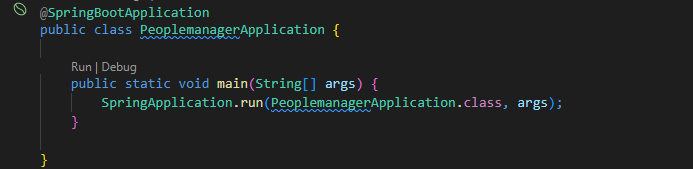

# API Rest Spring Boot Gerenciamento de Pessoas

Criação de uma pequena API que irá armazenar alguns dados pessoais.

### 📋 Pré-requisitos

```
Visual Studio Code instalado e com a versão dark, por favor rsrs, aquele Java 11 no talento e fé (vai funcionar!).
```

## ⚙️ Executando os testes

Vamos lá essa parte é bem rápida e bastante importante.

Esse teste foi feito para realizar a validação da criação de um objeto (Person).


## 🧨 Bora rodar!



```
Só clicar e deixar acontecer ...
```
## Quase esqueci o link para brincar [swaggerui.](http://localhost:8080/swagger-ui/index.html#/)
```
Só lazer
```

## 🛠️ Construído com

Mencione as ferramentas que você usou para criar seu projeto

* [Spring Boot](https://start.spring.io/)
* [Maven](https://maven.apache.org/)
* [Java](https://www.oracle.com/br/java/technologies/javase/jdk11-archive-downloads.html)

## ✒️ Autor

* **Gilberto** - [linkedin](https://www.linkedin.com/in/gilbertomacena/)

## 🎁 Gratidão

* Codar é bom demais.


---
⌨️ com ❤️ por [Gilberto Silva](https://github.com/XxGiillxX/XxGiillxX) 😊